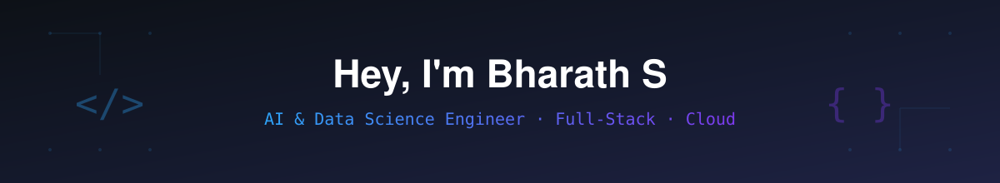

<div align="center">




</div>

<br>

> Final-year AI & Data Science student. Ships code, ships clarity.

## About Me

```yaml
name       : Bharath S
location   : Coimbatore, India
role       : AI & Data Science Engineer (Graduating May 2026)
learning   : Generative AI, RAG systems, cloud-native architectures
focus      : Turning AI models into deployed, real-world products
available  : Open to internships, roles & collaborations
```

- Building projects at the intersection of AI/ML and full-stack development
- Comfortable across AWS, Docker & Vercel — from EC2 to Lambda to live deployments
- Also fluent in data & BI tooling — SQL, Power BI, Excel
- Interned across a startup product team and a cloud/DevOps environment
- Active on LeetCode — grinding DSA (graphs, DP, trees)

## Tech Stack

**AI / ML & Generative AI**


**Web & Backend**


**Cloud & DevOps**


**Databases & Data / BI**


## Featured Projects

| Project | Description |
|---|---|
| Tourist Safety Monitoring System | Real-time threat detection with LSTM, automatic SOS alerts, live MongoDB backend on Vercel |
| AI RAG System | Document Q&A agent built with LangChain + OpenAI, full ingestion-to-response pipeline |
| Fitness Tracker & Posture Corrector | Computer-vision rep counter & form corrector, full-stack on Node.js & MySQL |
| AI Resume Analyser | 85%-accurate NLP classifier served via Flask for HR pipelines |

*(Update the links on these once pushed to your own repos.)*

## GitHub Metrics

<div align="center">


</div>

<table width="100%">
<tr>
<td width="50%"></td>
<td width="50%"></td>
</tr>
</table>

## Contribution Calendar

<div align="center">


</div>

## Contribution Snake

<div align="center">


</div>

All of the images above are generated and committed straight into this repo's `assets/` folder by the GitHub Action in [`.github/workflows/profile-assets.yml`](./.github/workflows/profile-assets.yml) — nothing here is loaded live from a third-party site.

## Connect With Me

[](https://linkedin.com/in/bharath-s-673a54352)
[](mailto:Bharathsprivatemail@gmail.com)
[](https://leetcode.com/u/mrBharath_1111)
[](https://github.com/mrBharath2626)

<div align="center">

**Open to internships & full-time roles in AI/ML and Full-Stack — let's build something together.**

</div>